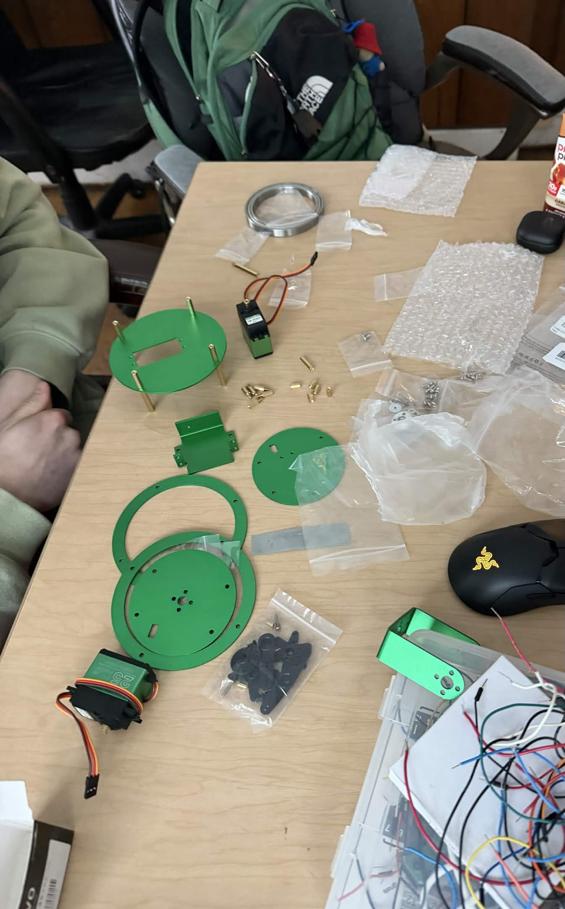

# HARDWARE DOCUMENTATION

This document outlines all hardware used in this project and all required assembly.

---

## Pi5
The system is powered by a Raspberry Pi 5, which is responsible for:
- Running the control API (FastAPI)
- Handling video streaming and recording (FFmpeg)
- Sending PWM/I2C signals to the servo driver

### Key Features
- Quad-core CPU capable of handling real-time video processing
- GPIO support for I2C communication with peripherals
- USB support for webcam and external storage
- Ethernet/WiFi for remote control and streaming

### Connections
- I2C → PCA9685 Servo Driver  
- USB → Webcam  
- USB → External storage (recordings)   

### Power
- Powered via USB-C

---

## Yahboom 2-DOF Servo Pan-Tilt Kit for DIY Robot
We chose this pan and tilt kit as it is a high-quality all-in-one kit capable of supporting both a camera and a laser diode.
- Contents:
  - 2 high-torque servos  
  - Aluminum chassis and mounting brackets  

### Servo 1 (Pan - Top)
- 20kg metal gear servo  
- 0°–270° range of motion  
- Requires 6–7.4V

### Servo 2 (Tilt - Bottom)
- 25kg metal gear servo  
- 0°–180° range of motion  
- Requires 6–7.4V 

### Pulse Angles
Servo position is controlled via PWM pulse width:
```
0.5ms--------------------0°
1.0ms--------------------45°
1.5ms--------------------90°
2.0ms--------------------135°
2.5ms--------------------180°
```

#### [Amazon Link](https://www.amazon.com/Yahboom-Pan-Tilt-Electric-Platform-Accessories/dp/B0BRXVFCKX/)
#### [Build Instructions](https://www.yahboom.net/study/2DOF-PTZ)
#### [Build Video](https://www.youtube.com/watch?v=CBgL3jvkomg)

---

## Servo Driver PCA9685
This board was chosen because it allows precise PWM control over multiple devices using I2C communication.

### Features
- 16 independent 12-bit PWM channels
- I2C controlled (only 2 wires needed from Pi)
- Stable servo control without CPU timing issues

### Connections
- VCC → 3.3V (logic power from Pi)
- GND → Common ground (Pi + power supply)
- SDA → Pi SDA (GPIO2)
- SCL → Pi SCL (GPIO3)
- V+ → External 6V power supply

### Usage in This Project
- Channel 0 → Pan servo
- Channel 1 → Tilt servo
- Channel 2 → MOSFET (laser control)

### Pinout:


#### [Amazon Link](https://www.amazon.com/HiLetgo-PCA9685-Channel-12-Bit-Arduino/dp/B07BRS249H/)

---

## Laser Diode
This laser diode is used as a controllable output mounted alongside the camera.

### Specifications
- Operating voltage: 5V  
- Constant-on device

### Mounting
- Attached to the top plate of the pan-tilt assembly  
- Aligned with camera direction  

### Control
- Controlled via MOSFET and PCA9685

#### [Amazon Link](https://www.amazon.com/20pcs-650nm-Laser-Diode-Diameter/dp/B088PQQ9XV/)

---

## Mosfet
The MOSFET module is used to control the laser diode safely using a PWM signal.

### Purpose
- Allows low-power PWM signal to control a higher-power device
- Acts as a switch between external power supply and laser

### Operation
- PWM signal from PCA9685 → MOSFET input  
- External 5V supply → MOSFET → Laser diode  
- PWM controls ON/OFF and brightness

### Wiring
- PWM input → PCA9685 channel  
- V+ → External 5V  
- GND → Common ground  
- Output → Laser diode  

### Note
A USB cable was cut to provide 5V power for the laser.

#### [Amazon Link](https://www.amazon.com/Anmbest-High-Power-Adjustment-Electronic-Brightness/dp/B07NWD8W26/)

---

## External Power Supplies
External power supplies are required to power both servos  and laser without overloading the Raspberry Pi.

### Requirements
- 6–7.4V for servos
- Sufficient current for two servos
- 5 volt for laser
- 30mA for laser

### Configuration
- Servos powered directly from external supply via PCA9685 V+  
- Laser powered through MOSFET from 5V source (USB Cable)
- **All grounds must be connected together (common ground)**

### Important Note
Do not power servos from the Raspberry Pi.

#### [Amazon Link](https://www.amazon.com/SHNITPWR-Universal-Adjustable-100V-240V-Converter/dp/B08BL55LMB/)

---

## Wiring

### Overview:
- Pi → PCA9685 (I2C)
- PCA9685 → Servos (PWM)
- PCA9685 → MOSFET (PWM)
- MOSFET → Laser (power switching)
- External PSU → PCA9685 → Servos
- External 5V → MOSFET
- Common GND shared across all components

---

### Raspberry Pi → PCA9685 Driver
| Raspberry Pi Pin | Driver Pin |
|------------------|------------|
| Pin 1 (3.3V)     | VCC        |
| Pin 6 (GND)      | GND        |
| Pin 3 (GPIO 2)   | SDA        |
| Pin 5 (GPIO 3)   | SCL        |

---

### PCA9685 Driver → Servos
Each servo has 3 wires:
- **Red** → V+ (power rail on PCA9685)
- **Brown/Black** → GND
- **Yellow/Orange** → PWM signal

Connections:
- Channel 0 → Pan servo  
- Channel 1 → Tilt servo  

---

### PCA9685 Driver → MOSFET
The MOSFET is controlled like a servo (PWM signal only):
- PCA9685 **Channel 2 (Signal pin)** → MOSFET **PWM/Input**
- PCA9685 **GND** → MOSFET **GND**

*(No V+ from PCA9685 is used for the MOSFET power)*

---

### MOSFET → Laser
The MOSFET acts as a switch for the laser’s power:
- MOSFET VOUT+ → Laser+
- MOSFET VOUT- → Laser-

---

### External Power Supplies
The PCA9685's V+ rail is powered externally by the adjustable power supply. Connect PSU to the V+ screw terminal. **Do not exceed board voltage rating (6V).**
Use a 5v power supply for the Mosfet V+ and V- input (screw terminal). In our case we cut a 5v usb cable. 

---

### Wiring Notes
- All grounds must be connected together:
  - Pi GND
  - PCA9685 GND
  - PSU GND
  - MOSFET GND
- Do not power servos from the Raspberry Pi
- Verify polarity before powering the laser
- Use adequately rated wiring for servo current
- The PCA9685 provides only the control signal, not power to the mosfet.

---

# Our Construction
Our assembly of the hardware.




